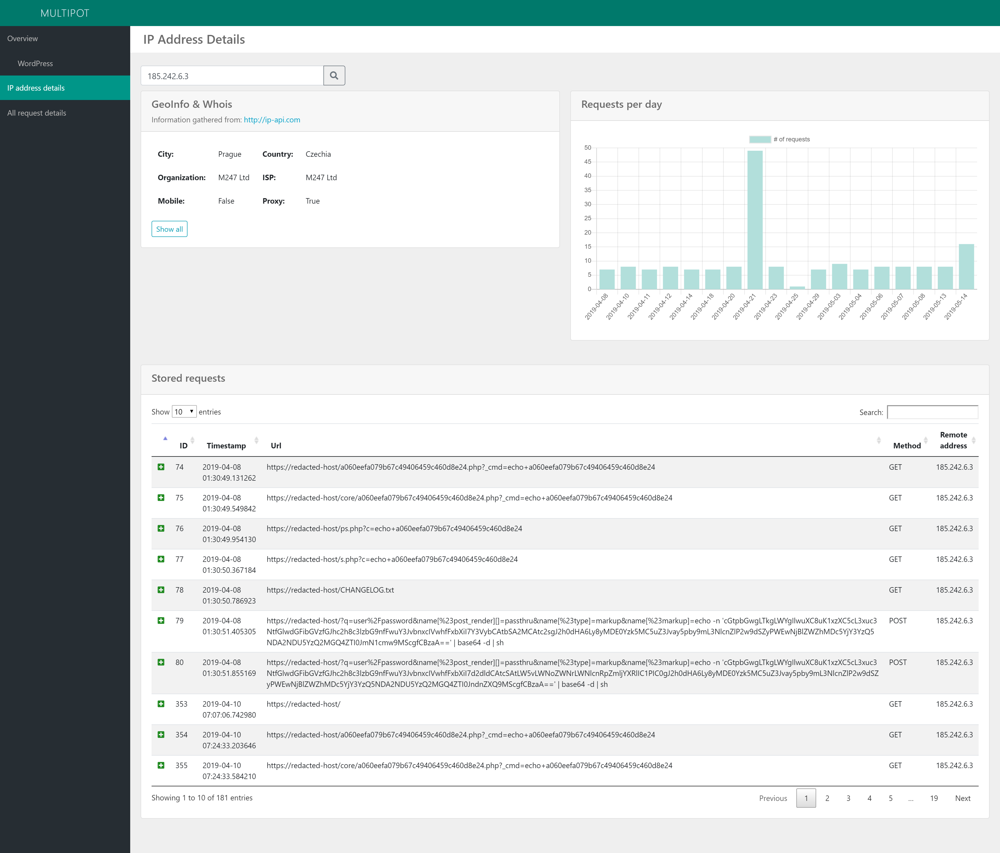

# Multipot

Multipot is a small Python-based web application honeypot. It makes it easy to set up fake web applications and record the requests given to them in an easily readable SQLite database. 
The built-in web analysis tool allows some basic analysis of the gathered requests.

The following pictures show examples of the built-in analysis capabilities of Multipot.





# Features
* Web application honeypot
* Saves client requests and server responses in SQLite database
* Built-in web GUI analysis tool
  * Use the SQLite database with your favorite tool for further analyses
* Detailed information on gathered IP addresses
  * Utilizes free http://ip-api.com for whois/geoip information (free version doesn't allow SSL access)
* Extensible, create your own fake pages


# Installation

## Step 1: Clone or download the repository

## Step 2: Install prerequisites
```
pip3 install flask
pip3 install flask-sqlalchemy
pip3 install requests
```
For basic testing, the app can now be run with:
```
$ python3 multipotapp.py
```
Go to the URL below to enter the dashboard:
```
http://<server>:5000/analysis/index?token=verysecret
```

This should not be used in production. Please follow the more detailed installation procedure below.

## Step 3: Follow the official Flask deployment documentation:

http://flask.pocoo.org/docs/1.0/deploying/


For example mod_wsgi via Apache:

http://flask.pocoo.org/docs/1.0/deploying/mod_wsgi/


##### Quick summary for Ubuntu/Debian with Apache:
```
# Python 3:
$ sudo apt-get install libapache2-mod-wsgi-py3
```

Create the `yourapplication.wsgi` file. Depending on your setup, adjust Python load path in it.
```
import sys
sys.path.insert(0, '/path/to/the/application')

from yourapplication import app as application
```

Configure Apache:
```
<VirtualHost *>
    ServerName example.com

    WSGIDaemonProcess yourapplication user=user1 group=group1 threads=5
    WSGIScriptAlias / /var/www/yourapplication/yourapplication.wsgi

    <Directory /var/www/yourapplication>
        WSGIProcessGroup yourapplication
        WSGIApplicationGroup %{GLOBAL}
        # Order deny,allow    # old syntax
        # Allow from all      # old syntax
        Require all granted   # new syntax
    </Directory>
</VirtualHost>
```


## Step 4: Initialize database
Use the provided empty `app.db` or generate a new basic `app.db` database:
```
$ python3 app/setup_db.py
```

## Step 5: Configure application !
Have a look at the `config.py` for configurations.

Change your secret `ANALYSIS_TOKEN`! Otherwise others with access to your webserver can access the API and analysis sections of the honeypot.


# Basic usage

After the setup browse to the following URL to see an overview on the recorded requests and their related responses:
```
http(s)://<server>/analysis/index?token=<ANALYSIS_TOKEN>
```

## Add your own fake websites
1. Save your HTML skeleton in `app/static/fake-sites/newfakeapp/newfakeapp.html`
2. Create new or modify route in `app/routes.py`